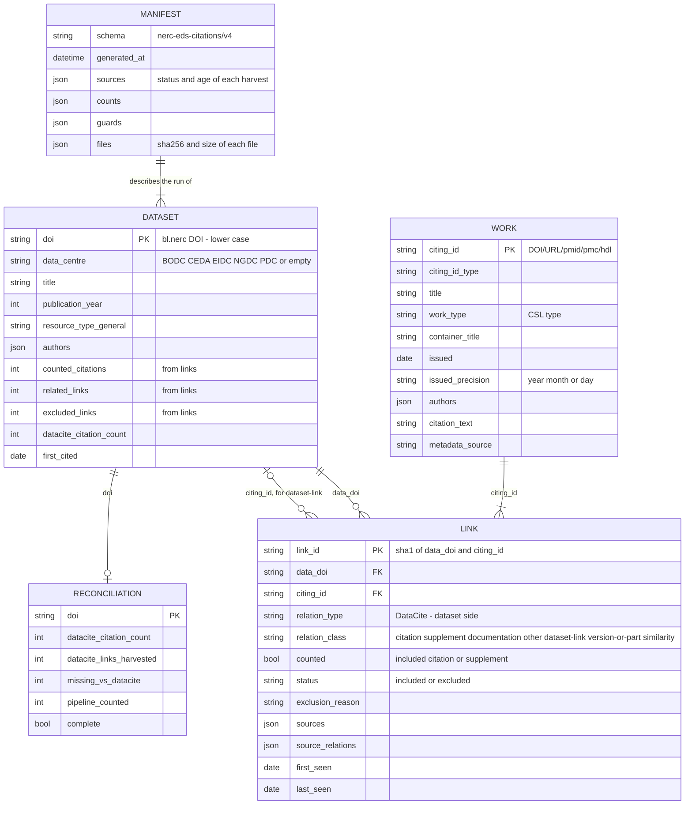

# NERC EDS dataset citations

Harvests the links between NERC Environmental Data Service datasets (DataCite client `bl.nerc`) and the works that cite or relate to them. Each link gets a class, and the results are published in `Results/v4`, which the EDS citation API, the citation widget and the data centres' cited-data catalogues read. A v3-compatible copy is still written to `Results/v3` while consumers move over.

This is not a census of every citation. It covers what DataCite, Scholexplorer, Overton and Crossref expose openly.

## What changed from v3

v3 was five notebooks run by five scheduled workflows, with pickles committed between stages. A review in October 2026 found gaps that had built up unnoticed. Version 4 replaces the notebooks with a `citations` package, one CLI, one workflow and a SQLite store.

| v3 problem | v4 |
| --- | --- |
| The DataCite stage asked only for `is-cited-by`, `is-referenced-by` and `is-supplement-to` with the dataset as subject. It never saw citations from journal reference lists, which Crossref deposits as `references` events with the article as subject. These were 99% of the DataCite links missing from v3. | Harvests the exact list behind DataCite's `citationCount` for every cited dataset, labelled from its events. It also reads incoming relations from the datasets' own `relatedIdentifiers`. |
| Scholexplorer similarity recommendations (`HasAmongTopNSimilarDocuments`) were counted as citations: 44% of v3 rows. | Every link has a `relation_class`. Similarity and dataset-to-dataset links are published as related links and never counted. |
| Overton read only the first dataset each policy document cites. Its API key was in the code. | Every highlight is used. The key comes from the `OVERTON_API_KEY` secret (**rotate the old key**: it is in the git history). |
| The inventory used page-number paging with no completeness check: 12 DOIs were missing and 10 were duplicated. | Cursor paging, de-duplication, and the run fails if the count differs from DataCite's total. |
| Links were deleted by filters, and before Sept 2026 some were dropped without a record. Publication dates were the DOI registration date, written as D/M/YYYY. The pre-dates rule used a one-year cut. | Exclusions are kept with a `status` and `exclusion_reason`. Dates are the `issued` date in ISO 8601, with their precision. The pre-dates rule needs a gap of **two years or more**. |
| Each stage committed whatever it produced; an empty Scholexplorer harvest was published for 8 months. | A harvest only replaces the previous one when it succeeds. Publishing is refused when a required source failed, is stale or lost rows, and an issue is opened. |
| De-duplication used raw strings, so URL case variants survived, and only the first source was credited. | Identifiers are normalised and every source that found a link is listed. |

## Running it

```
pip install -e ".[test]"
export CITATIONS_MAILTO=you@example.org     # Crossref / DataCite polite pools
export OVERTON_API_KEY=...                   # optional; Overton is skipped without it
python -m citations all                      # the weekly run
python -m citations status                   # what ran and what is used
```

Stages can be run separately. Each one reads and writes the store at `data/citations.sqlite` (change it with `--db`):

| Command | Does |
| --- | --- |
| `inventory [--snapshot F] [--save-snapshot F]` | Every DOI of `bl.nerc`, checked against DataCite's total. `--snapshot` rebuilds from a saved download. |
| `harvest [datacite scholexplorer overton crossref] [--no-resume]` | Harvests the sources. An interrupted or partial harvest resumes and retries only what failed. |
| `works` | Metadata and a plain-text citation string for each citing work, cached and refreshed every 90 days. |
| `merge` | One link per dataset × citing work from each source's latest good harvest, classified and filtered. |
| `publish [--force] [--no-v3]` | Writes `Results/v4` and `Results/v3` if the guards pass. `--force` publishes anyway and records that in the manifest. |
| `reconcile` | Compares each dataset with DataCite's `citationCount`. |

Exit codes: 0 success, 1 a stage failed, 2 publishing was blocked by a guard.

### The weekly workflow

`.github/workflows/citations.yml` runs every Sunday: tests, then `python -m citations all`, then it commits `Results/v4` and `Results/v3`. The SQLite store is carried between runs in the Actions cache. If the cache has been evicted, the run rebuilds it from scratch, which takes longer, and first-seen dates come from the published `links.csv`. The store and the DataCite snapshot are also kept as a 30-day run artifact. A failed or blocked run opens or updates an issue labelled `citations-pipeline`, and the previous results stay as they were.

Set the repository secret `OVERTON_API_KEY` and the variable `CITATIONS_MAILTO`.

#### Testing on a fork before a pull request

GitHub only starts scheduled and manual runs from a repository's default branch. To test a branch such as `v4` on a fork:

1. In the fork, enable Actions, and under Settings → Actions → General → Workflow permissions choose "Read and write".
2. Add the secret `OVERTON_API_KEY`, and the variables `CITATIONS_MAILTO`, `CITATIONS_BRANCH` = `v4` and, to keep result commits out of the branch you will open the pull request from, `CITATIONS_COMMIT_RESULTS` = `false`. The results are still uploaded as a run artifact.
3. Push a change under `citations/`, to `pyproject.toml` or to the workflow on `v4` to start a run. Use "Re-run all jobs" on that run to repeat it.

Upstream needs none of these variables: the workflow runs on the default branch, and pushes do not start it.

## Checking the results

`inspect_results.ipynb` validates and summarises what has been published. It calls no citation API. Install with `pip install -e ".[notebook]"`, open it, and in the Settings cell choose a `Results` folder or this repository on GitHub at a branch, tag or commit, and optionally a second version to compare with.

- **Validation** (PASS / WARN / FAIL / INFO, with the failing rows written to `inspect_outputs/`): `Results/v4` against the format below, its integrity, the counting rules, the manifest and the reconciliation; `Results/v3` for CSV–JSON parity and data quality, and, when v4 is present, that it holds exactly v4's counted links.
- **Overview**: counted citations and related links per data centre, sources and how often they agree, exclusions, metadata completeness, the most-cited datasets, citations by UK fiscal year, and links new since a date.
- **One dataset**: `show_dataset(doi)`.
- **Comparison** with the other version: per-dataset changes, and `compare_dataset(doi)` for new, gone and unchanged citing works. A legacy v3 version is classified with the v4 rules first, so counts compare like for like.

## Counting rules

A **link** is one dataset and one citing work, with every source that reported it. Relations are stored in the DataCite vocabulary *from the dataset's side*: `IsCitedBy` means the other work cites the dataset. Relations where the dataset is the one citing or deriving (`References`, `Cites`, `IsDerivedFrom`, `IsCompiledBy` …) are not links to the dataset and are dropped at harvest.

| `relation_class` | From | Counted |
| --- | --- | --- |
| `citation` | `IsCitedBy`, `IsReferencedBy` | yes |
| `supplement` | `IsSupplementTo`, `IsSupplementedBy` (either direction) | yes |
| `documentation` | `IsDocumentedBy`, `IsDescribedBy`, `IsReviewedBy` | no, related |
| `other` | `IsRequiredBy`, `IsSourceOf`, `Compiles` | no, related |
| `dataset-link` | any of the above where the other work is itself a NERC dataset (`10.5285/…`) | no, related dataset |
| `version-or-part` | `IsPartOf`, `HasPart`, `IsNewVersionOf`, `IsPreviousVersionOf` … | no, related dataset |
| `similarity` | Scholexplorer `HasAmongTopNSimilarDocuments` | no, related dataset |

When sources disagree about one pair, the most specific class wins: citation, then supplement, documentation, other, version-or-part, similarity.

`counted` is true for included `citation` and `supplement` links. The catalogue and widget should show the rest as *related datasets and documents*, never in the citation count.

A link is **excluded**, but still published, when the first of these applies:

| `exclusion_reason` | Rule |
| --- | --- |
| `self-link` | the citing work is the dataset |
| `comment` | title starts "Comment on", "Reply on", "Reply to comment by", "Final response" or "Author response" |
| `peer-review` | the work type is a peer review |
| `conference-abstract` | an EGUsphere abstract |
| `gbif-download` | a GBIF download DOI (`10.15468/…`) |
| `predates-data` | the work was issued **two or more years** before the dataset's publication year (citation, supplement, documentation and other links only) |

## Results/v4

Bare lower-case DOIs; ISO 8601 dates; empty means null (no "Info not given"); lists and objects are JSON (a JSON string in CSV cells); JSON files are flat arrays that carry `data_centre`. Files are sorted, so weekly diffs are small.

| File | One row per |
| --- | --- |
| `datasets.csv`, `datasets.json` | `bl.nerc` DOI, cited or not |
| `links.csv`, `links.jsonl` | dataset × citing work, excluded links included |
| `works.csv`, `works.json` | citing work |
| `reconciliation.csv` | dataset cited by DataCite or by the pipeline |
| `manifest.json` | run: sources and their status and age, counts, guard results, reconciliation summary, and the sha256 and size of every other v4 file, so a reader can check it fetched one consistent set |

How the files fit together: a link joins one dataset to one citing work, and every link, work
and reconciliation row comes from the same run, which the manifest describes. When the citing
work is itself a NERC dataset, its `citing_id` is that dataset's DOI and the link is a
`dataset-link`.



**links**

| Field | Notes |
| --- | --- |
| `link_id` | sha1 of `data_doi` + `|` + `citing_id`; stable across runs |
| `data_doi`, `data_centre` | `data_centre` is `BODC`, `CEDA`, `EIDC`, `NGDC`, `PDC` or empty |
| `citing_id`, `citing_id_type` | DOI if there is one, else a canonical URL, `pmid:…`, `pmc:…` or `hdl:…`; type `doi`, `url`, `pmid`, `pmc`, `handle` |
| `relation_type` | DataCite vocabulary, from the dataset's side |
| `relation_class`, `counted` | see the counting rules above |
| `status`, `exclusion_reason` | `included` / `excluded` and why |
| `sources` | e.g. `["datacite:crossref", "scholexplorer"]`. DataCite links are labelled by origin: `datacite:crossref` (journal reference lists), `datacite:metadata` (the data centre's relatedIdentifiers) |
| `source_relations` | the raw relation each source reported, for audit |
| `first_seen`, `last_seen` | replace `date_added`; seeded from v3's `date_added` on the first run |

**works**: `citing_id`, `citing_id_type`, `title`, `work_type` (CSL type where known), `container_title`, `publisher`, `issued`, `issued_precision` (`year`, `month`, `day`), `authors` (array of `{given, family, name, orcid}`), `citation_text`, `metadata_source` (`crossref`, `datacite`, `inventory`, or the harvesting source when no DOI metadata exists), `fetched_at`.

**datasets**: `doi`, `data_centre`, `data_centre_name`, `publisher`, `title`, `publication_year`, `resource_type_general`, `registered`, `authors`, `counted_citations`, `related_links`, `excluded_links`, `datacite_citation_count`, `first_cited` (issued date of the earliest counted citing work).

**reconciliation**: for each dataset, DataCite's `citationCount`, how many of DataCite's citing works were harvested, and how those were classified. A run fails the guard when more than 5% of DataCite-cited datasets have fewer harvested DataCite links than their `citationCount`.

## Results/v3 (deprecated)

Still written each run, from v4: included, counted links only, in the same 18 columns, with `date_added` taken from `first_seen`. Differences consumers may notice:

- **Fewer, more accurate rows.** Similarity, dataset-to-dataset and version links are no longer in it.
- `publication_date` is ISO 8601.
- `relation_type_id` is the dataset-side relation in kebab case (`is-cited-by`).
- `citation_event_source` is one of `datacite`, `scholex`, `overton`, `crossref`.
- `filtered_out_df.csv` gains an `exclusion_reason` column.

`Results/v1` and `Results/v2` are no longer updated.

## Guards

Publishing is refused (exit code 2, previous results kept, an issue opened) when:

- the inventory, DataCite or Scholexplorer has no successful harvest in the last 8 days, or its latest run failed, was partial or was rejected;
- a harvest lost more than 20% of its links compared with the last good harvest, or the published links of a required source fell by more than 20% compared with the last manifest;
- more than 2% of a source's requests failed (the harvest is *partial* and resumes next run);
- reconciliation with DataCite is incomplete for more than 5% of DataCite-cited datasets.

Overton and Crossref are optional: their failures produce warnings in the manifest, and their last good harvest is used.

## Development

```
pytest                      # offline: a fake HTTP layer stands in for every API
```

The modules are `citations/inventory.py`, `citations/sources/{datacite,scholexplorer,overton,crossref}.py`, `citations/works.py`, `citations/merge.py`, `citations/filters.py`, `citations/relations.py`, `citations/publish.py`, `citations/guards.py` and `citations/reconcile.py`. The store's schema is in `citations/db.py`. Citation strings (`citations/citation_text.py`) are ported unchanged from v3's `getCitationString`.

## Authors

Matthew Nichols (UKCEH) wrote the original pipeline. The Crossref functions were adapted from the demo notebooks in the Crossref [rest-api-doc](https://github.com/CrossRef/rest-api-doc) repository.